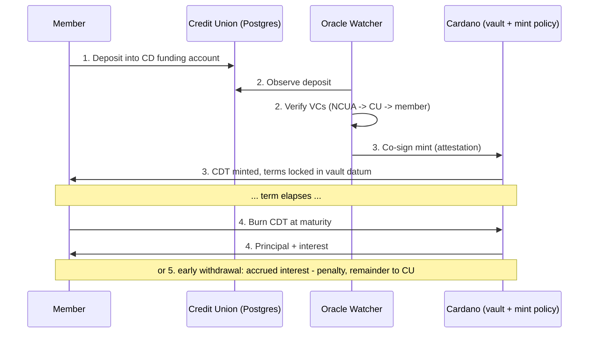

# Certificate of Deposit Token (CDT)

**Author:** Noah Jones

Tokenized certificates of deposit on Cardano, issued by a credit union and
gated by W3C verifiable credentials.

## What is CDT?

A certificate of deposit is a simple, well-understood financial product: a
member locks a deposit at an insured institution for a fixed term at a fixed
rate. CDT puts a verifiable, self-custodied representation of that contract
on-chain — without moving the deposit itself.

- **For members:** the CDT is a portable, cryptographically verifiable record
  of their CD. They hold it in their own wallet, can prove ownership of it to
  anyone, and redeem it on-chain at maturity for principal plus interest.
- **For credit unions:** CDT is designed as a compliant on-ramp to digital
  assets. The
  deposit never leaves the insured institution — the token represents the CD
  contract, not the money. Issuance is gated by a credential trust chain
  rooted at the NCUA, so only verified members of insured institutions can
  mint.

The project originated in 2021 with pilot interest from CampusUSA Credit
Union (see [History](#history)). This repository is a working local
demonstration of the rebuilt architecture: Aiken (Plutus V3) validators
on-chain, a TypeScript off-chain stack, a Postgres bank simulator, and mock
decentralized-identity credentials.

## How it works

1. **Deposit.** A member deposits into a dedicated CD funding account at the
   credit union.
2. **Attest.** An oracle watcher observes the deposit in the bank's Postgres
   database, verifies the member's verifiable credentials (NCUA →
   `InsuredInstitutionCredential` → credit union → `AccountHolderCredential`
   → member), and attests by co-signing the mint transaction.
3. **Mint.** A CDT native asset is minted (asset name = the bank deposit id).
   The CD terms `{principal, rate_bps, start, maturity, penalty_bps}` are
   locked as an inline datum at an Aiken vault validator that holds principal
   plus the full interest.
4. **Mature.** At maturity, the member burns the CDT and redeems principal
   plus simple interest from the vault.
5. **Early withdrawal.** Before maturity, the member may burn the CDT and
   withdraw early: they receive accrued interest minus a penalty, and the
   remainder returns to the credit union.



## Identity: the PRISM questionnaire, answered

The original 2021 README posed the Atala PRISM builder-program questions and
left them blank. Here are the answers. (Atala PRISM has since been succeeded
by Hyperledger Identus, which is the production path; this repo ships a mock
`did:key`/VC implementation in `credentials/`.)

| Question | Answer |
| --- | --- |
| **What type of solution do you want to build on PRISM?** | A verifiable-credential-gated tokenized financial instrument — a certificate of deposit — on Cardano. Credentials gate minting: no valid trust chain, no token. |
| **What vertical interests you?** | Credit-union / community-bank finance. |
| **What type of credentials will be issued?** | Two: `InsuredInstitutionCredential`, issued by the NCUA to the credit union (proof of NCUSIF insurance); and `AccountHolderCredential`, issued by the credit union to the member (proof of verified membership/KYC). |
| **Who is the Holder? What is the value of the credential to the holder?** | The member holds the `AccountHolderCredential`: portable proof of verified membership and KYC status, reusable across services rather than repeating onboarding. The credit union holds the `InsuredInstitutionCredential`: portable proof that it is an NCUSIF-insured institution. |
| **Who will be the Issuer / Who will be the Verifier?** | Issuers: the NCUA (trust root) and the credit union. Verifier: the oracle/minting gate, which checks the full chain before co-signing a mint — and any other relying party that wants to verify either credential. |

## Repository map

| Directory | Contents |
| --- | --- |
| `onchain/` | Aiken (Plutus V3) validators: `cd_vault` (holds principal + interest, enforces terms) and `cdt_mint` (mint/burn policy); scaffold `deposit_registry`; compiled `plutus.json` blueprint. |
| `offchain/cdt-txlib/` | TypeScript transaction library: datum codecs, simple-interest math, and transaction builders. |
| `offchain/oracle-watcher/` | The oracle: polls the bank database, verifies credentials, and produces signed mint attestations. |
| `offchain/demo/` | Flagship narrated demo of the full CD lifecycle on a local Lucid emulator (`npm run demo`). |
| `offchain/pipeline/` | End-to-end issuance service (watcher → mint → redeem). |
| `offchain/testnet/` | Preview-testnet lifecycle + evidence notes. |
| `webapp/` | Member portal and **bank desks**: issuer tokenize (`#/open`), correspondent presentment (`#/present`), payment terminal (`#/pay`), mobile sign (`#/sign`). |
| `bank-sim/` | Postgres bank simulator (schema + seed data) via Docker, on port 55432. |
| `credentials/` | Mock `did:key` DIDs and W3C verifiable credentials (production path: Hyperledger Identus). |
| `docs/` | **[Operator manual](docs/manual.md)**, [docs index](docs/README.md), whitepaper, network package, production readiness, security audit. |
| `legacy/` | The original 2021 material (Plutus/Haskell experiments and planning docs), kept for provenance. |
| `.github/workflows/` | CI: Aiken checks and package tests. |

## Quickstart

Prerequisites: [Aiken](https://aiken-lang.org) (install via `aikup`) and
Node.js 22. Use `npm ci --include=dev` in this monorepo.

**Full operator / demo guide:** [docs/manual.md](docs/manual.md)  
**Documentation index:** [docs/README.md](docs/README.md)

```sh
# 1. Check the on-chain validators
cd onchain
aiken check
cd ..

# 2. Run the flagship lifecycle demo (local emulator; no real chain needed)
cd offchain/demo
npm ci --include=dev
npm run demo
cd ../..

# 3. Optional: bank simulator + webapp desks
cd bank-sim
docker compose up -d --wait
npm ci --include=dev
npm run db:apply && npm run seed
cd ../webapp
npm ci --include=dev
PGHOST=localhost PGPORT=55432 PGUSER=bank PGPASSWORD=bank PGDATABASE=bank_sim \
  CDT_ALLOW_OPEN_API=1 ALLOW_EPHEMERAL_PAYMENT_ORACLE=1 \
  BURN_VALIDATE_MODE=off SETTLEMENT_RAIL=mock \
  npm run dev
# Portal: http://localhost:5173/   API: http://127.0.0.1:8787/api/health
```

Each TypeScript package also has its own test suite:

```sh
npm ci --include=dev && npm test
```

## Status

This is a **working local demonstration**, not a production system. The demo
runs against an in-process emulator with mock credentials; there is no
deployed mainnet contract, no real bank integration, and no regulatory
approval. Nothing in this repository is legal or financial advice.

### Documentation

| Doc | Purpose |
| --- | --- |
| [docs/manual.md](docs/manual.md) | **Operator & demo manual** (run, desks, env, smoke) |
| [docs/README.md](docs/README.md) | Full documentation index |
| [docs/whitepaper.md](docs/whitepaper.md) | Product thesis |
| [docs/architecture.md](docs/architecture.md) | System design |
| [docs/production-readiness.md](docs/production-readiness.md) | Pilot checklist |
| [docs/security-audit.md](docs/security-audit.md) | Security findings |
| [docs/network/](docs/network/) | Multi-CU settlement package |
| [docs/compliance.md](docs/compliance.md) | CIP / BSA framing |

2021 origins (Plutus/Haskell prototypes, meeting notes, Catalyst proposal
drafts): see `legacy/`.

## History

CDT began in 2021 as a Plutus (Haskell) prototype paired with outreach to a
local credit union. First contact was an unplanned visit to CampusUSA Credit
Union on 2021-07-27 ("I was there for another reason, and I asked for
information about CDs. Just out of curiosity, I asked to speak with
someone."), followed days later by the feedback logged below. The original
log entries are preserved verbatim:

> 20210727145800NJ I did this meeting.
>
> 20210730104931NJ I just received phenominal feedback. The credit union
> wants me to come back as soon as I have a working version. Meeting: This
> went very well. They are open to the idea. The union has not started to
> partake in crypto yet. Mary said that she is looking forward to when I can
> provide a demonstration. I need an LLC and a business card.
>
> 20210730110222NJ I fleshed out the plan.
>
> 20210808122447NJ Did some re-organizing.

The rebuild in this repository replaces the Plutus/PAB stack with Aiken (Plutus V3) and
`@lucid-evolution/lucid`, and the Atala PRISM identity layer with a mock
implementation targeting Hyperledger Identus.
