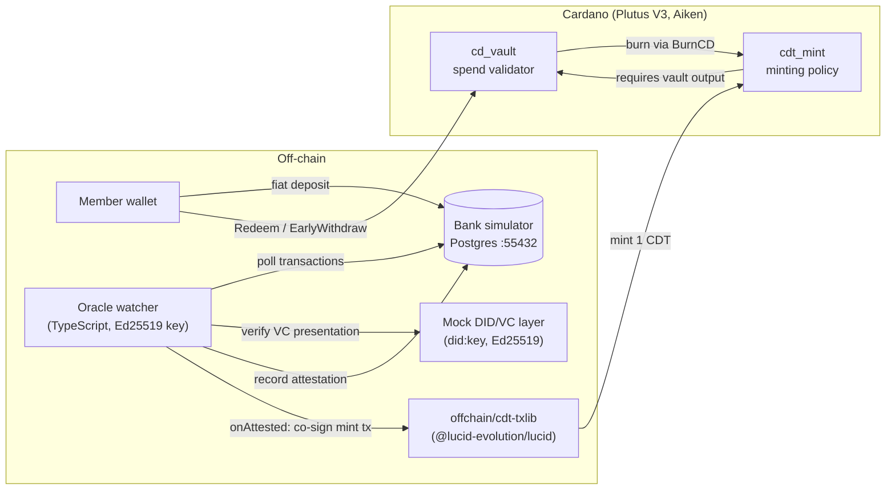
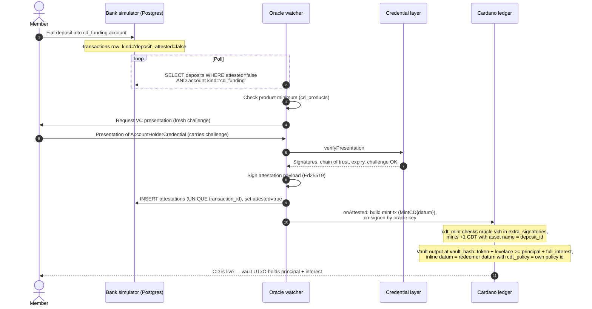
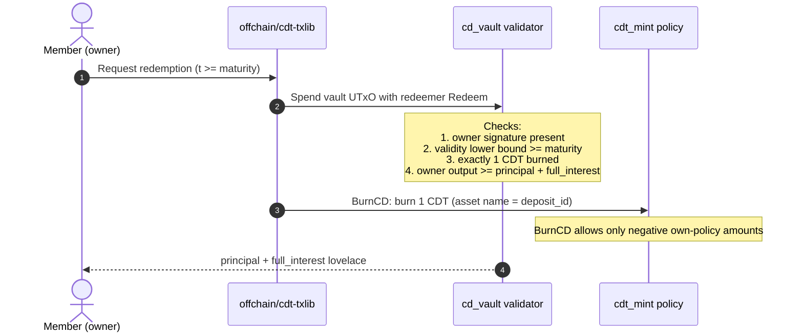
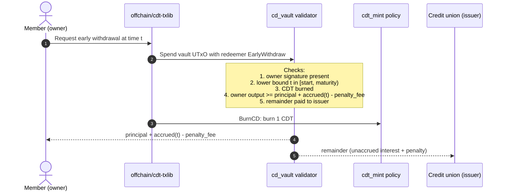
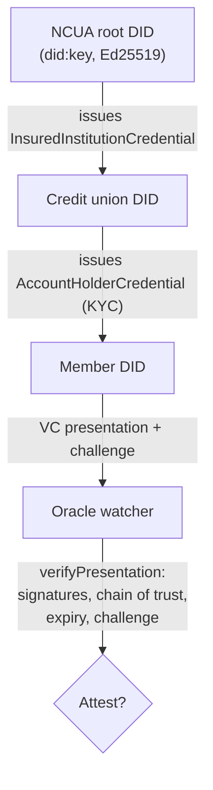
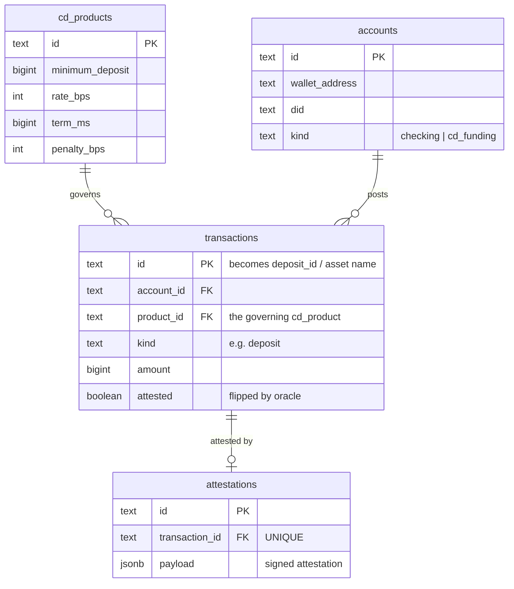

# CDT Technical Architecture

Certificate of Deposit Token (CDT) is a system in which a credit union issues
tokenized certificates of deposit (CDs) on Cardano. A member funds a CD with
fiat at the credit union; an oracle attests to that deposit; a native token
(the CDT) is minted and locked with the CD's terms in an on-chain vault; and
at maturity the member redeems the vault for principal plus interest — or
exits early for principal plus accrued interest less a penalty — burning the
token either way.

This document describes the rebuilt architecture: the on-chain validators
(Aiken, Plutus V3), the oracle watcher, the bank simulator, the mock
DID/verifiable-credential layer, and the off-chain transaction library. It
concludes with an honest analysis of the trust model and a path to
production.

## Contents

1. [System overview](#1-system-overview)
2. [Lifecycle flows](#2-lifecycle-flows)
3. [On-chain design](#3-on-chain-design)
4. [Oracle design](#4-oracle-design)
5. [Credential layer](#5-credential-layer)
6. [Data model (bank simulator)](#6-data-model-bank-simulator)
7. [Off-chain library and demo](#7-off-chain-library-and-demo)
8. [Security and trust assumptions](#8-security-and-trust-assumptions)
9. [Path to production](#9-path-to-production)

## 1. System overview

The system's components:

| Component | Technology | Role |
| --- | --- | --- |
| `cd_vault` spend validator | Aiken, Plutus V3 | Locks principal + interest; enforces redemption and early-withdrawal rules |
| `cdt_mint` minting policy | Aiken, Plutus V3 | Mints exactly one CDT per attested bank deposit; enforces vault output shape |
| Oracle watcher | TypeScript | Polls the bank database, verifies credentials, signs attestations, triggers mints |
| Credential layer (mock DID/VC) | TypeScript (did:key, Ed25519) | Issues and verifies the credentials that gate attestation, off-chain at the oracle |
| Bank simulator | Postgres (Docker, port 55432) | Authoritative ledger for fiat: products, accounts, transactions, attestations |
| Off-chain library and demo | TypeScript, @lucid-evolution/lucid | Transaction builders (`offchain/cdt-txlib`) and a narrated end-to-end demo (`offchain/demo`) |



The key linkage is the `deposit_id`: the bank transaction id of the fiat
deposit becomes the CDT's on-chain asset name, so every token corresponds to
exactly one attested bank deposit, and each deposit can back at most one
token. Within a single mint transaction the policy enforces exactly +1 of
that asset name; across transactions, uniqueness rests on the
single-attestation guarantee — the `attestations` table enforces
`UNIQUE (transaction_id)`, and an honest oracle never co-signs a second mint
for the same deposit (see section 8).

## 2. Lifecycle flows

### 2.1 Mint / attestation flow



The credit union funds the vault output with `principal + full_interest`
lovelace at mint time, so redemption never depends on a later top-up.

### 2.2 Redeem at maturity



### 2.3 Early withdrawal



## 3. On-chain design

Both scripts are written in Aiken and compile to Plutus V3. The build emits a
CIP-57 blueprint (`plutus.json`) consumed by the off-chain library.

### 3.1 `cd_vault` spend validator

Each CD is a single UTxO at the vault script address carrying an inline
datum:

```text
CDDatum {
  owner        : VerificationKeyHash   -- the member
  issuer       : VerificationKeyHash   -- the credit union
  deposit_id   : ByteArray             -- = CDT asset name = bank tx id
  principal    : Int                   -- lovelace
  rate_bps     : Int                   -- annual rate, basis points
  start        : Int                   -- POSIX ms
  maturity     : Int                   -- POSIX ms
  penalty_bps  : Int                   -- early-withdrawal penalty, basis points
  cdt_policy   : PolicyId              -- minting policy id of the CDT
}
```

Two redeemers govern spending:

**`Redeem`** (at or after maturity). The transaction must:

1. carry the `owner`'s signature;
2. have a validity-interval lower bound `>= maturity`;
3. burn exactly 1 CDT (policy `cdt_policy`, asset name `deposit_id`);
4. pay the owner `>= principal + full_interest` lovelace.

**`EarlyWithdraw`** (before maturity). Using `t` = the transaction's
validity lower bound, the transaction must:

1. carry the `owner`'s signature;
2. have `t` in `[start, maturity)`;
3. burn the CDT;
4. pay the owner `>= principal + accrued(t) - penalty_fee`;
5. pay the remainder to the `issuer`.

### 3.2 Interest math

All arithmetic is integer arithmetic with floor division; there are no
rationals or floats on-chain.

```text
YEAR_MS       = 31_557_600_000   -- Julian year in milliseconds

full_interest = principal * rate_bps * (maturity - start)
                / (10_000 * YEAR_MS)

accrued(t)    = principal * rate_bps * (clamp(t, start, maturity) - start)
                / (10_000 * YEAR_MS)

penalty_fee   = accrued(t) * penalty_bps / 10_000
```

`clamp` bounds `t` to `[start, maturity]`, so `accrued` never exceeds
`full_interest` and never goes negative. Because both the vault and the
off-chain builders use the same formulas, the amounts a builder computes are
exactly the minimums the validator enforces.

### 3.3 `cdt_mint` minting policy

The minting policy is parameterized by `(oracle_vkh, vault_hash)` — the
oracle's verification key hash and the vault script hash — applied via
`applyParamsToScript` from the CIP-57 blueprint.

**`MintCD { datum }`** — the redeemer carries the full `CDDatum` (the
attestation data). The policy requires:

1. the oracle's key appears in `extra_signatories` — this co-signature *is*
   the attestation;
2. exactly `+1` of asset name `deposit_id` is minted under this policy (and
   nothing else under it);
3. the transaction has an output at `vault_hash` that
   - holds the newly minted token,
   - carries `>= principal + full_interest` lovelace, and
   - has an inline datum equal to the redeemer's datum with
     `cdt_policy` set to the policy's own id.

**`BurnCD`** — allows only negative amounts of the policy's own assets. In
the normal lifecycle the CDT lives inside the vault UTxO from mint onward,
so a burn happens in the same transaction that spends the vault: the vault
redeemers each require the burn, and `BurnCD` itself imposes no further
conditions.

### 3.4 No hash circularity

A naive design has a chicken-and-egg problem: the vault wants to know the
CDT policy id to verify burns, and the policy wants to know the vault hash
to verify the locked output — each script's hash would depend on the
other's. The rebuilt design breaks the cycle in three steps:

1. **The vault compiles standalone.** It takes no policy-id parameter; it
   reads `cdt_policy` from its own datum at spend time.
2. **The policy is parameterized by the vault hash** (which now exists),
   plus the oracle key hash.
3. **The vault learns the policy id from its datum**, and the *policy*
   verifies at mint time that the vault output's inline datum has
   `cdt_policy` equal to the policy's own id.

So the datum field the vault later trusts is guaranteed correct by the only
code path that can create a vault UTxO holding a genuine CDT: the mint
itself. No script hash ever needs to embed the other's hash reciprocally.

## 4. Oracle design

The oracle watcher is a TypeScript service holding an Ed25519 signing key.
Its loop:

1. **Poll** the bank Postgres for rows in `transactions` where
   `kind = 'deposit'`, `attested = false`, and the destination account has
   `kind = 'cd_funding'`.
2. **Check the product minimum** against `cd_products`.
3. **Verify the member's VC presentation** (signature chain, expiry,
   challenge — see section 5).
4. **Sign an attestation payload** (Ed25519) binding the deposit to the CD
   terms.
5. **Record** the attestation in `attestations` and flip
   `transactions.attested = true` — the `UNIQUE (transaction_id)` constraint
   makes double-attestation impossible at the database layer.
6. **Fire `onAttested`**, which builds the mint transaction; the oracle key
   co-signs it, satisfying the policy's `extra_signatories` check.

### Why co-signature instead of an oracle UTxO

The original 2021 design followed the then-common *oracle-UTxO* pattern: the
oracle continually publishes signed data as datums on UTxOs, and consuming
contracts read (and spend) those UTxOs. That pattern has two structural
costs:

- **UTxO contention.** Every transaction that reads the oracle competes for
  the same UTxO; concurrent mints serialize or fail.
- **Indirection.** The attestation lives in a separate UTxO that must be
  located, validated, and kept fresh.

The rebuilt design replaces this with an **oracle co-signature**: the
attestation data travels *inside the mint redeemer* (`MintCD { datum }`),
and the policy checks (a) the oracle key in `extra_signatories` and (b) that
the vault output's datum matches the redeemer's datum. There is no shared
oracle UTxO, hence no contention — any number of mints can proceed in
parallel — and the attested data is verified in the same transaction that
uses it.

## 5. Credential layer

Credential gating is **off-chain, at the oracle** — the chain never checks a
credential. The demo uses a mock decentralized-identity stack:

- **DID method:** `did:key` over Ed25519 keys.
- **Chain of trust:**



- The **NCUA root** issues an `InsuredInstitutionCredential` to the credit
  union's DID, establishing that the issuer is a federally insured
  institution.
- The **credit union** issues an `AccountHolderCredential` (the KYC
  credential) to the member's DID.
- When the member's deposit is being attested, the member supplies a
  **presentation carrying a challenge** (preventing replay), and the
  oracle's `verifyPresentation` checks signatures, the chain of trust back
  to the NCUA root, credential expiry, and the challenge.

The production path replaces this mock stack with **Hyperledger Identus**
(the successor to Atala PRISM); see section 9.

## 6. Data model (bank simulator)

The bank simulator is a Postgres instance (Docker, host port **55432**). It
is the authoritative system of record for fiat.



The bank simulator's migrations own the exact column sets; the diagram shows
the fields the architecture depends on. Key points:

- `accounts.kind` distinguishes `checking` from `cd_funding`; only deposits
  into `cd_funding` accounts are candidates for attestation.
- `accounts` links banking identity to on-chain identity
  (`wallet_address`) and decentralized identity (`did`).
- `transactions.attested` is the oracle's work queue flag.
- `attestations.transaction_id` is `UNIQUE`, and the `payload` is stored as
  JSONB — one attestation per deposit, ever.
- `transactions.id` is the `deposit_id` that becomes the CDT asset name,
  giving a 1:1 bank-ledger-to-token correspondence auditable from either
  side.

## 7. Off-chain library and demo

- **Library:** `@lucid-evolution/lucid`.
- **Blueprint:** `aiken build` emits a CIP-57 blueprint (`plutus.json`);
  validators are loaded from it, and the minting policy is instantiated with
  `applyParamsToScript(oracle_vkh, vault_hash)`.
- **Provider:** the demo and tests run against Lucid's local `Emulator` — no
  external node or testnet needed for development.
- **Transaction builders** live in `offchain/cdt-txlib`: mint (oracle
  co-signed), redeem-at-maturity, and early-withdrawal builders that
  replicate the on-chain interest math so built transactions meet the
  validator's minimums exactly.
- **Flagship demo** lives in `offchain/demo`: a narrated end-to-end run —
  seed the bank, deposit, attest, mint, warp time, redeem (and an
  early-withdrawal branch) — using short maturities so the full lifecycle
  plays out in seconds on the emulator.

## 8. Security and trust assumptions

An honest accounting of what the system does and does not guarantee:

| Assumption | Consequence | Mitigation / status |
| --- | --- | --- |
| **The oracle is a trusted single signer.** | A compromised oracle key can mint CDTs for fabricated deposits (the credit union must still fund each vault, which bounds the damage, but trust is concentrated). | Federated / multisig oracle is future work (section 9). |
| **The credit union funds interest at mint.** | Each vault holds `principal + full_interest` from day one, so redemption is fully collateralized on-chain — but the issuer bears the full carry up front. | By design; removes any dependence on future issuer solvency for an already-minted CD. |
| **The bank database is authoritative for fiat.** | The chain reflects the bank ledger, not vice versa; a corrupted bank DB corrupts attestations. | Standard database controls; the attestation payload (JSONB) is an audit trail. |
| **Token holder custody = wallet custody.** | Whoever satisfies the `owner` signature check redeems. Losing the wallet key means losing the CD claim on-chain. | Institutional custody / key recovery is an operational concern, not solved in-protocol. |
| **VC verification is off-chain.** | The chain does not know whether the redeemer still holds a valid credential; gating happens only at mint time, at the oracle. | An on-chain credential check is future work. |
| **Demo conditions differ from production.** | The demo uses short maturities and the Lucid emulator; timing, fees, and contention behave differently on a real network. | Preview testnet then mainnet hardening (section 9). |

What the on-chain design *does* guarantee, given an honest oracle:

- No CDT exists without an oracle-attested deposit, and each `deposit_id`
  mints at most one token.
- Every genuine CDT is born alongside a vault UTxO holding at least
  `principal + full_interest`, with terms fixed in an inline datum the
  policy verified at mint.
- Only the owner can unlock the vault, only at valid times, only by burning
  the token, and only while receiving at least the formula-defined payout;
  early exits route the remainder back to the issuer.

## 9. Path to production

1. **Real decentralized identity: Hyperledger Identus.** Replace the mock
   `did:key` stack with Identus (the Atala PRISM successor): PRISM DIDs,
   standards-compliant VC issuance and presentation exchange, and revocation
   support — the trust chain (NCUA root → credit union → member) maps
   directly onto Identus issuer flows.
2. **Oracle federation.** Move from a single trusted signer to a federated
   or multisig oracle: the minting policy's attestation check generalizes
   from one `oracle_vkh` to a k-of-n signer set, so no single key
   compromise can authorize a mint.
3. **Testnet → mainnet.** Graduate from the local emulator to the Cardano
   preview testnet with realistic maturities, then to mainnet. This adds
   real providers (in place of the emulator), fee and contention testing,
   and end-to-end rehearsal of the oracle service against a live chain.
4. **Key management.** Production oracle and issuer keys belong in HSMs,
   with rotation procedures and separation between the attestation signer
   and treasury/funding keys.
5. **Operations.** Monitoring for the oracle loop (poll lag, attestation
   failures, mint confirmation), alerting on vault balance anomalies, and a
   **burn-on-early-closure runbook** so operations staff can execute the
   early-withdrawal path (burn + payout split) correctly when a member
   closes a CD before maturity.
6. **On-chain credential checks (future work).** Longer term, move part of
   the credential verification on-chain so redemption — not just minting —
   can be credential-gated where regulation requires it.
