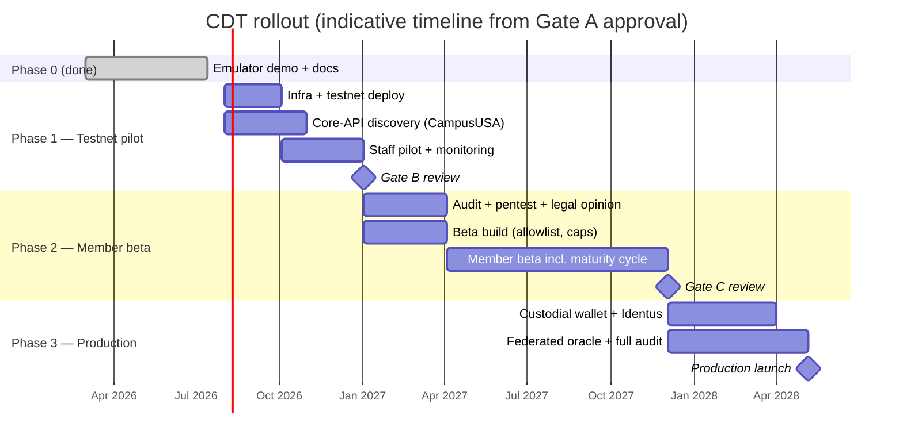

# CDT Phased Rollout Strategy

**Project:** Certificate of Deposit Token (CDT)
**Author:** Noah Jones
**Status:** Working draft
**Related documents:** [Feasibility study](./feasibility.md) · [Architecture](./architecture.md) · [Proposal](./proposal.md) · [Why Cardano](./why-cardano.md) · [Compliance](./compliance.md)

---

## 1. Approach

CDT rolls out in four phases, each one deliberately small enough to stop
cheaply and each gated by explicit go/no-go criteria (defined in
[feasibility.md §7](./feasibility.md)). The guiding rules:

1. **No member funds touch the system until the mechanics have run for months
   with staff accounts on a real chain.**
2. **Every phase produces a decision artifact** for the credit union board and
   (from Phase 2) for NCUA engagement — not just working software.
3. **Blast radius is capped by construction**: emulator → testnet → small,
   allowlisted, non-transferable beta → production.

Timeline estimates are indicative; each phase begins only when its gate
passes, so calendar dates slide rather than gates being skipped.

## 2. Phase 0 — Emulator demonstration (complete)

**This is the artifact CampusUSA asked for in July 2021** ("looking forward to
when I can provide a demonstration" — meeting log, CDT02). It now exists.

**Scope (delivered):**

- Aiken vault and mint validators; CD terms in datum (`principal`,
  `rate_bps`, `start`, `maturity`, `penalty_bps`); oracle co-signature gating
  minting.
- TypeScript off-chain code on `@lucid-evolution/lucid` running the full
  lifecycle — deposit → attest → mint → mature → redeem, plus
  early-withdrawal-with-penalty — on the local Emulator.
- Postgres bank-core simulator; mock DID/VC credential chain
  (NCUA → credit union → member).
- Documentation set (architecture, proposal, why-Cardano, compliance,
  feasibility, this rollout plan).

**Exit criterion (met):** demo is reproducible from a clean checkout on a
laptop, with no external network dependencies.

**Immediate use:** present to CampusUSA leadership as the promised
demonstration; secure a named executive sponsor and agreement for the Phase 1
core-systems discovery.

## 3. Phase 1 — Preview-testnet pilot (internal)

**Duration:** ~3–5 months. **Participants:** credit union staff only.
**Money:** fake dollars in the bank-core simulator; test ADA on the Cardano
**preview testnet** — a real, public chain with real network conditions, real
fees, and real finality, but zero financial exposure.

### 3.1 Phase 1 scope

- Deploy validators to preview testnet; run the oracle as a hosted service
  (KMS-backed key, no more in-memory keys) against the Postgres simulator.
- 10–30 staff accounts open, hold, and redeem simulated CDs through a minimal
  web UI; include deliberate failure drills (oracle down, core down, rollback).
- **Core-API discovery track (critical path):** technical workshops with
  CampusUSA's core vendor to establish what integration surface actually
  exists — real-time API, message queue, or nightly batch — and prototype the
  read path the oracle needs. This retires the project's biggest unknown
  ([feasibility §2.2](./feasibility.md)).
- Stand up monitoring/alerting (chain confirmations, oracle liveness, daily
  core↔chain reconciliation job) and draft the incident runbooks.

### 3.2 Phase 1 success metrics

| Metric | Target |
| --- | --- |
| Lifecycle completion rate (mint→redeem incl. early withdrawal) | ≥ 99% of attempted flows |
| Reconciliation mismatches (unexplained) | 0 |
| Oracle availability over final 60 days | ≥ 99.5% |
| Failure drills executed with runbook | ≥ 3 scenarios |
| Core integration read-path prototype | Working against vendor sandbox or documented batch fallback |
| Staff usability score | ≥ 4/5 on internal survey |

### 3.3 Phase 1 exit criteria

All success metrics met, plus Gate B GO conditions
([feasibility §7](./feasibility.md)): scoped audit, pentest, legal opinion,
board approval, NCUA briefing completed.

**Dependencies:** executive sponsor (from Phase 0); core-vendor cooperation;
Phase 1 budget.

## 4. Phase 2 — Limited member beta

**Duration:** ~8–12 months (must include at least one full CD maturity cycle —
e.g., offer a 6-month share certificate so the cycle completes within the
phase). **Participants:** allowlisted volunteer members. **Money:** real
member deposits at small caps, insured share certificates recorded in the
real core, mirrored on-chain (mainnet or preview per legal advice — mainnet
preferred so custody and fee operations are exercised for real).

### 4.1 Phase 2 guardrails

- **Allowlisted members only** — beta agreement signed; identity verified via
  the credit union's existing KYC, bound to the mock-then-Identus credential
  chain.
- **Non-transferable tokens** — the validator refuses transfers to
  non-allowlisted addresses; no secondary market exists in beta, which also
  simplifies the securities analysis (see [compliance](./compliance.md)).
- **Caps:** e.g., $500–$5,000 per member, aggregate program cap (e.g., $250k)
  set with the board at Gate B. The core ledger remains the legal system of
  record throughout; the token is a representation, so a worst-case on-chain
  failure never threatens the member's insured deposit.
- **Board + NCUA engagement:** quarterly board reporting; NCUA examiner
  briefing before launch and at mid-phase, per the compliance doc's engagement
  plan.

### 4.2 Phase 2 scope

- Production-grade oracle (HSM/KMS key, rotation drill performed once during
  the phase).
- Member-facing UI with plain-language CD terms; support staff trained with
  scripts; support ticket taxonomy for the pilot.
- Live core integration for the read/attest path (from Phase 1 discovery);
  daily reconciliation with paging.
- Full incident-response process active; one tabletop exercise with credit
  union operations staff.

### 4.3 Phase 2 success metrics

| Metric | Target |
| --- | --- |
| Fund-safety incidents | 0 |
| Unexplained core↔chain mismatches | 0 |
| Members onboarded | ≥ 50 (floor: 25 — below floor is a stop signal) |
| Full maturity cycles completed | ≥ 1 per participating member cohort |
| Early withdrawals processed correctly (penalty applied) | 100% |
| Support tickets per member per month | ≤ 0.5 after month 2 |
| Member satisfaction (CSAT) | ≥ 4/5 |
| Oracle availability | ≥ 99.5% |

### 4.4 Phase 2 exit criteria

All metrics met; Gate C GO conditions hold (full audit, federated oracle
ready, custodial wallet vendor contracted, Identus integration replacing
mocks, 90 days of SLO compliance, regulator engagement current).

**Dependencies:** Gate B artifacts (audit, legal opinion, board/NCUA);
core-vendor production API access; beta member recruitment via the
communication plan (§7).

## 5. Phase 3 — Production

**Duration:** ~4–6 months build/hardening, then general availability.
**Participants:** open to the membership, subject to board-approved program
limits that step up over time.

### 5.1 Phase 3 scope

- **Custodial wallet option (default):** members interact through online
  banking; keys held by the credit union or a vetted custody vendor under the
  third-party risk framework. Self-custody remains an opt-in path with
  recovery education.
- **Hyperledger Identus credentials in production:** NCUA → credit union →
  member verifiable-credential chain replaces the Phase 0 mocks; credential
  checks bound into onboarding and (where the design requires) redemption.
- **Federated oracle / multisig:** ≥ 3-of-n oracle signatures required to
  mint, with keys held across independent infrastructure (and, if partner
  credit unions join later, across institutions).
- **Monitoring and SRE:** SLOs with error budgets, on-call rotation, quarterly
  failure drills, continuous reconciliation.
- **Final smart-contract audit** of the exact deployed code, published to
  members and shared with regulators; annual re-audit on material change.
- Transferability, secondary-market features, or multi-institution federation
  are **explicitly out of scope** for initial production and require their own
  regulatory analysis and board approval later.

### 5.2 Production ramp

Start with the same caps as Phase 2, then raise stepwise (e.g., 2× per
quarter) while incident and reconciliation metrics stay clean. Any Sev-1
incident freezes the ramp until a post-mortem is accepted by the board's
technology committee.

### 5.3 Ongoing exit criteria (steady state)

Production continues only while: zero unexplained ledger mismatches; audit
currency maintained; NCUA supervisory posture unchanged; unit economics
(support load, infra cost per CD) within the board-approved envelope. A
standing decommission plan exists: because the core is always the system of
record, the program can be wound down by ceasing issuance and honoring
redemptions — tokens burn at redemption and the book runs off naturally.

## 6. Dependencies between phases

| Dependency | Produced in | Consumed by |
| --- | --- | --- |
| Reproducible demo + sponsor buy-in | Phase 0 | Gate A / Phase 1 |
| Core-API discovery findings | Phase 1 | Phase 2 integration build; feasibility cost refresh |
| Runbooks + monitoring stack | Phase 1 | Phase 2 operations |
| Scoped audit, pentest, legal opinion, NCUA briefing | Gate B work | Phase 2 launch |
| One full maturity cycle of clean data | Phase 2 | Gate C evidence pack |
| Custody vendor + Identus integration | Phase 3 build | Production launch |
| Federated oracle keys ceremony | Phase 3 build | Production launch |

The single most schedule-sensitive dependency is **core-vendor cooperation**
(Phase 1): it sits on the critical path of everything downstream and is
outside the project's direct control. It is therefore started in the first
month of Phase 1 and its failure is an explicit Gate B NO-GO.

## 7. Communication plan

### 7.1 Member education

- **Principles:** never require members to understand blockchain to buy a CD;
  lead with the product ("a share certificate you can see and verify"), not
  the technology; be blunt that on-chain transactions are final and about how
  to avoid scams and phishing — a commitment carried over from the original
  2021 execution plan.
- **Materials:** one-page plain-English explainer; short video for the beta
  cohort; FAQ maintained from real support tickets; in-branch talking points
  for tellers/member-service staff (trained in Phase 2).
- **Cadence:** beta invitation → onboarding walkthrough → maturity-reminder
  notices (a member-experience win over paper CDs) → post-beta results
  summary shared with participants.

### 7.2 Regulator and board briefings

- **Board:** demo at Gate A; written phase report + metrics at every gate;
  quarterly during Phases 2–3; immediate notice of any Sev-1 incident.
- **NCUA / state supervisor:** initial briefing before Phase 2 (aligned with
  the [compliance doc](./compliance.md) engagement plan), mid-beta update,
  pre-production briefing with the audit report and Phase 2 evidence pack.
  Posture: proactive disclosure, consistent with NCUA's expectation of sound
  risk management around DLT (Letter 22-CU-07).
- **Core vendor:** treated as a communication stakeholder, not just a
  supplier — early technical workshops (Phase 1) and a named escalation
  contact.

### 7.3 Public communication

Nothing public before Gate B passes. At Phase 2 launch: a low-key member
newsletter item, not a press release. A public announcement (and any
industry/press outreach, including sharing results with other credit unions —
an original 2021 goal) waits until production has run cleanly for one
quarter.

## 8. Summary timeline

| Phase | Indicative duration | Cumulative elapsed | Gate to advance |
| --- | --- | --- | --- |
| 0 — Emulator demo | done | — | Gate A |
| 1 — Testnet internal pilot | 3–5 months | ~5 months | Gate B |
| 2 — Limited member beta | 8–12 months | ~15 months | Gate C |
| 3 — Production build + ramp | 4–6 months to GA | ~20 months | Steady-state criteria |

Roughly **15–23 months from Gate A to general availability** (sum of the
phase ranges above; ~20 months on the gantt's critical path), with three
clean opportunities to stop at low cost if the evidence says stop. That
pacing is deliberate: the instrument being tokenized is a federally insured
member deposit, and the rollout is designed so that the boring, safe path is
also the default path.
