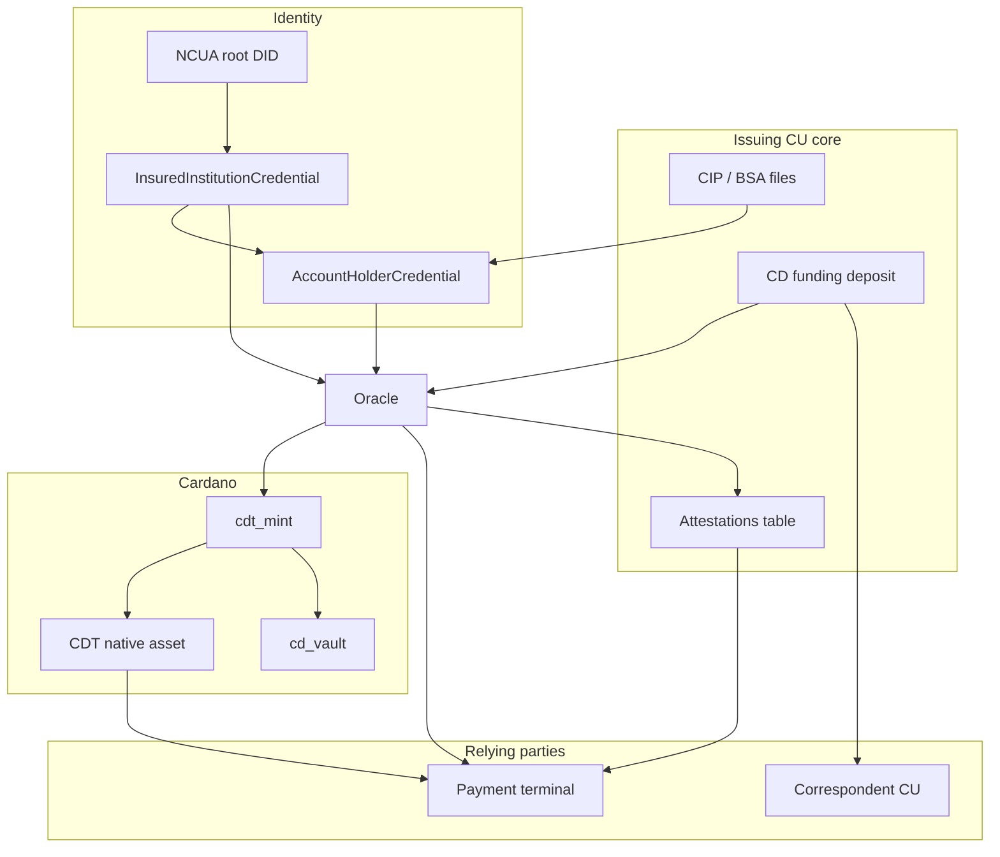

# Certificate of Deposit Token (CDT)

## Whitepaper

**Version:** 1.0  
**Author:** Noah Jones  
**Organization:** CDT project / Jones Financial Services (prototype)  
**Date:** July 2026  
**Status:** Technical whitepaper for the working prototype  

**Related documents:** [Architecture](./architecture.md) · [Compliance analysis](./compliance.md) · [Business proposal](./proposal.md) · [Business plan](./business-plan.md) · [Settlement network package](./network/README.md) · [Feasibility](./feasibility.md) · [Rollout](./rollout.md) · [Why Cardano](./why-cardano.md) · [Payment-check contract](./payment-check-contract.md) · [Product position (CU login → Lace)](./product-position.md)

---

> **Disclaimer.** This whitepaper describes a technology prototype and research
> architecture. It is **not** an offer to sell securities, deposits, tokens, or
> any financial product; it is not investment, legal, accounting, or tax advice;
> and it does not create a client relationship with any regulator or institution.
> No pilot involving real member funds may proceed without formal legal review,
> the issuing institution’s board approval, and engagement with the NCUA (and
> state supervisors where applicable). Statements about law and regulation
> reflect the authors’ understanding as of mid-2026 and may be outdated when you
> read this. Implementation details refer to the open repository at
> [Jones-Financial-Services/cdt](https://github.com/Jones-Financial-Services/cdt).

---

## Abstract

The Certificate of Deposit Token (CDT) is a **credential-gated, freely
spendable representation** of a federally insured credit-union share
certificate (certificate of deposit) on the Cardano blockchain. The member’s
**dollars never leave the credit union**. What moves on-chain is a
cryptographically verifiable **record of the contract**—principal, rate, term,
and early-withdrawal penalty—issued only after:

1. the deposit exists on the institution’s core ledger, and  
2. a trust chain of W3C Verifiable Credentials is verified  
   (NCUA → insured institution → member).

**Product position:** a member should be able to **log into their credit union
account, buy a CD as CDT, and hold certificate control in a browser wallet**
(reference wallet: **Lace**, via CIP-30). The CU remains the front door; the
wallet is the delivery surface for the digital certificate—not a substitute
for the insured deposit on the issuer’s books.

An **oracle** operated for the credit union co-signs minting. An on-chain
**vault** enforces mature redemption and early withdrawal with the same simple
interest math used off-chain. The CDT native asset is **freely transferable**
after mint; payment terminals that want extra security **opt in** to a
short-lived, oracle-signed **payment-check contract** (`cdt.payment_check.v1`)
that re-validates the issuer’s deposit attestation without freezing or
allowlisting transfers. Non-issuing credit unions can run a **correspondent
presentment** desk: verify a foreign claim, advance cash under local CIP/OFAC,
and settle with the issuer—without becoming the insurer of the original
deposit.

This paper specifies the problem, design principles, architecture, identity
model, on-chain and off-chain components, payment verification, correspondent
flows, trust assumptions, regulatory posture, and the state of the working
prototype.

---

## 1. Introduction

### 1.1 Motivation

Certificates of deposit (CDs), known in the credit-union system as **share
certificates**, remain one of the safest household savings instruments: fixed
term, fixed rate, and—when issued by a federally insured credit union—coverage
under the National Credit Union Share Insurance Fund (NCUSIF). Yet they are
still administered as **paper-bound, institution-siloed contracts**. A member
who needs liquidity before maturity has little option beyond early withdrawal
with penalty. Third parties (lenders, executors, auditors, merchants) cannot
cheaply verify the existence or terms of a certificate without manual inquiry.
Younger members increasingly expect portable digital assets, while speculative
crypto custody is a poor cultural fit for the cooperative movement.

Credit unions therefore need a **digital-native form** of a product that
remains a **plain insured deposit in substance**.

### 1.2 Thesis

**Tokenization should change the record, not the money.**

CDT posits that:

- The **authoritative deposit liability** stays on the credit union’s core
  books (and under NCUSIF).  
- A **Cardano native asset** can carry a portable, self-custodied proof of the
  certificate’s economic terms.  
- **Issuance** must be gated by real-world KYC/CIP and institutional insurance
  status, expressed as a verifiable-credential trust chain.  
- **Redemption math** can be enforced by a deterministic on-chain vault that
  mirrors the product disclosure.  
- **Secondary use** (payment, peer transfer) can remain **freely spendable at
  the ledger layer**, with **opt-in oracle checks** for counterparties that
  require attestation freshness—without pretending the token *is* the insured
  deposit.

### 1.3 Origin

The concept was first discussed with **CampusUSA Credit Union** (Gainesville,
Florida) in July 2021. Leadership asked for a working demonstration. The
repository now implements that demonstration: Aiken (Plutus V3) validators, an
oracle watcher, a bank-core simulator, mock DID/VCs (production path:
Hyperledger Identus), transaction libraries, pipeline and testnet tooling, and
a member/merchant web portal.

---

## 2. Problem statement

| Pain | Consequence |
| --- | --- |
| Illiquid, paper-bound certificates | No portable evidence of terms; early exit is the only option |
| Non-portable membership proof | KYC is repeated; third parties cannot verify status |
| Opaque servicing | Accrual, penalties, and audit trails are batchy and error-prone |
| Missing “safe” digital on-ramp | Members leave for uninsured platforms; CUs lack supervised alternatives |
| Confusion with stablecoins | Payment tokens and term deposits are different legal and risk objects |

CDT addresses the **evidence and automation** layer while deliberately
**not** converting the CD into a payment stablecoin or uninsured crypto
deposit.

---

## 3. Solution overview

### 3.1 Lifecycle (issuing credit union)

```text
Member CIP/KYC ──► Core books CD funding deposit
                         │
                         ▼
              Oracle verifies VC chain + deposit
                         │
                         ▼
         Co-sign mint: 1 CDT (asset name = deposit_id)
         Vault locks principal + full interest + terms datum
                         │
            ┌────────────┴────────────┐
            ▼                         ▼
     Hold / transfer             At maturity: burn + Redeem
     (freely spendable)          Before maturity: burn + EarlyWithdraw
```

1. **Deposit.** Member funds a dedicated CD funding account on the core.  
2. **Credential.** Member holds an `AccountHolderCredential` from the CU;
   the CU holds an `InsuredInstitutionCredential` from an NCUA-rooted trust
   authority (simulated in the prototype).  
3. **Attest & mint.** Oracle observes the deposit, verifies a verifiable
   presentation, records a signed attestation, and co-signs a Cardano mint.  
4. **Hold.** Member self-custodies the CDT. The asset is freely transferable.  
5. **Exit.** Redeem at maturity or early-withdraw with penalty by burning the
   CDT against the vault rules.

### 3.2 What the token is and is not

| The CDT **is** | The CDT **is not** |
| --- | --- |
| A digital receipt of a specific share certificate | The deposit liability itself |
| Freely spendable native asset (post-mint) | An NCUA-insured “crypto deposit” |
| Terms-bound via vault datum at mint | A payment stablecoin under the GENIUS Act |
| Mint-gated by CIP-backed credentials | A substitute for the core CIP file |
| Redeemable by burning under vault rules | Automatically retitled insurance when transferred |

**Marketing invariant:** *The certificate of deposit is federally insured by
the NCUA up to applicable limits. The CDT token is a record of that
certificate. The token itself is not insured.*

### 3.3 Actors

| Actor | Role |
| --- | --- |
| **Member (holder)** | Owns deposit on core; holds wallet + `AccountHolderCredential` + CDT |
| **Issuing credit union** | Books the CD; funds vault; operates or sponsors the mint oracle |
| **NCUA-rooted issuer (trust root)** | Issues `InsuredInstitutionCredential` (demo: simulated root) |
| **Oracle** | Verifies deposit + VCs; signs mint attestation; offers payment checks |
| **Payment terminal** | Optionally verifies attestation before accepting CDT as consideration |
| **Correspondent (presenting) CU** | May advance cash against a foreign CDT and settle with the issuer |
| **Cardano ledger** | Enforces mint policy and vault redemption math |

---

## 4. Design principles

1. **Core ledger supremacy.** The insured claim lives on the institution’s
   books. Chain state is a gated representation, not a competing deposit
   register.  
2. **No PII on-chain.** Datum carries payment key hashes and economic terms
   only—not names, SSNs, or account numbers (GLBA).  
3. **Credentials attest CIP; they do not replace CIP.** Files stay off-chain.  
4. **One deposit, one token.** `deposit_id` is the asset name; double-mint is
   prevented by oracle discipline + unique attestation rows.  
5. **Deterministic money math.** Simple interest, integer floor division,
   identical on-chain and off-chain.  
6. **Freely spendable after mint; verify when you care.** Ledger transfers are
   unconstrained; risk-sensitive acceptors use the payment-check oracle.  
7. **Compliance-by-design before sales copy.** Securities, BSA/AML, NCUA
   guidance, and insurance disclosure shape the architecture (see §11).  
8. **Honest trust model.** Oracles and issuers are trusted for real-world
   facts; the chain enforces what it can without pretending omniscience.

---

## 5. System architecture

### 5.1 Components

| Layer | Component | Technology | Function |
| --- | --- | --- | --- |
| On-chain | `cdt_mint` | Aiken / Plutus V3 | Mint/burn policy; requires oracle vkh; vault shape |
| On-chain | `cd_vault` | Aiken / Plutus V3 | Holds principal + interest; Redeem / EarlyWithdraw |
| Off-chain | Bank core (sim) | Postgres | Products, accounts, deposits, attestations |
| Off-chain | Oracle watcher | TypeScript | Poll deposits, verify VCs, sign attestations |
| Off-chain | Credentials | TypeScript (`did:key` mock) | Issue/verify W3C VC 1.1 presentations |
| Off-chain | cdt-txlib | TypeScript + Lucid | Build mint/redeem transactions |
| Off-chain | Pipeline | TypeScript | End-to-end issuance service |
| Off-chain | Webapp | Hono + React | Member desk, correspondent desk, payment terminal |
| Off-chain | Payment oracle | TypeScript Ed25519 | Opt-in `cdt.payment_check.v1` |

### 5.2 Logical data flow



### 5.3 Deposit identity

The **bank transaction id** of the CD funding deposit becomes:

- the oracle attestation’s `deposit_id`, and  
- the **asset name** of the minted CDT.

Thus every token is 1:1 with a core deposit row (modulo oracle honesty and
unique constraints).

---

## 6. Identity and KYC

### 6.1 Trust chain

```text
NCUA (trusted root DID)
  └─ InsuredInstitutionCredential ──► Credit union DID
                                        └─ AccountHolderCredential ──► Member DID
```

**Issuers:** NCUA root (demo) and the credit union.  
**Holder:** Member (and CU for the institution credential).  
**Verifier:** Mint oracle; optionally payment oracle and correspondent desks.

### 6.2 Presentation verification (mint gate)

A standard verification checks, in order:

1. Presentation proof (holder signature + challenge anti-replay).  
2. Each credential’s issuer signature, purpose, and validity window.  
3. Trust chain back to configured roots via `InsuredInstitutionCredential`.  
4. Holder binding (member credential subject = presentation holder).

Production path: **Hyperledger Identus** (`did:prism`, real proof suites,
revocation). Prototype path: mock `did:key` + Ed25519 in `credentials/`.

### 6.3 BSA/AML sequencing

| Control | CDT handling |
| --- | --- |
| CIP (31 CFR § 1020.220) | Completed before `AccountHolderCredential` is issued |
| OFAC | At membership, credential issue, mint, and (if used) payment/presentment |
| CDD | Entity members: beneficial ownership before entity-level credentials |
| Travel Rule | Two-party deposit/redeem with issuer is not third-party transmission; free transfer of tokens may create separate analysis |
| SARs | Monitor CD funding patterns (rapid open/early-withdraw cycles) |

The credential is **evidence that CIP passed**, not a portable replacement for
the CIP file.

---

## 7. On-chain design

### 7.1 `CDDatum` (inline vault datum)

| Field | Meaning |
| --- | --- |
| `owner` | Member payment key hash |
| `issuer` | Credit union payment key hash |
| `deposit_id` | Bank deposit id / asset name |
| `principal` | Lovelace principal |
| `rate_bps` | Annual simple interest (basis points) |
| `start` / `maturity` | POSIX ms |
| `penalty_bps` | Penalty on accrued interest (early exit) |
| `cdt_policy` | Policy id that minted this CDT |

### 7.2 Mint policy (`cdt_mint`)

Parameterized by `(oracle_vkh, vault_hash)`.

**`MintCD { datum }`** requires:

- `oracle_vkh` among transaction extra signatories;  
- exactly +1 token named `datum.deposit_id` under this policy;  
- a vault output at `vault_hash` containing that token, lovelace ≥ principal +
  full interest, and inline datum equal to the attested terms with
  `cdt_policy` set to this policy;  
- sane terms (`maturity > start`, `principal > 0`).

**`BurnCD`** allows only strictly negative mint amounts (burns). Authorization
to unlock value is enforced by the vault spend, not by the burn alone.

### 7.3 Vault (`cd_vault`)

**`Redeem`:** owner signature; validity lower bound ≥ maturity; burn exactly
one matching CDT; owner receives ≥ mature payout.

**`EarlyWithdraw`:** owner signature; time in `[start, maturity)`; burn one
CDT; owner receives ≥ early payout; remainder to issuer.

**Anti-double-satisfaction:** at most one vault input from this script per
transaction.

### 7.4 Interest math

Let `YEAR_MS = 31_557_600_000` (Julian year in ms). All values are integers
with floor division:

```text
full_interest = principal * rate_bps * (maturity - start) / (10_000 * YEAR_MS)
accrued(t)    = principal * rate_bps * (clamp(t, start, maturity) - start)
                / (10_000 * YEAR_MS)
penalty_fee   = accrued(t) * penalty_bps / 10_000
early_payout  = principal + accrued(t) - penalty_fee
mature_payout = principal + full_interest
```

Off-chain libraries (`cdt-txlib`, portal projections) use the same formulas so
member UIs match validator enforcement.

### 7.5 Currency peg in the demo

The prototype treats **1 USD = 1 ADA** for illustration
(`1 cent = 10_000 lovelace`). Production would use a stable-denominated asset
or an explicit FX policy—not an implicit peg.

---

## 8. Oracle and attestation

### 8.1 Mint oracle (issuance)

The oracle watcher:

1. Polls unattested CD funding deposits.  
2. Enforces product minimums.  
3. Verifies the member’s verifiable presentation (pluggable hook).  
4. Builds and signs an attestation payload  
   `{ deposit_id, owner, principal, rate_bps, start, maturity, penalty_bps }`.  
5. Atomically inserts the attestation and marks the deposit attested.  
6. Invokes `onAttested` (pipeline mints with oracle co-signature).

**Trust assumption:** an honest oracle never attests the same `deposit_id`
twice. Uniqueness is enforced per mint transaction on-chain; cross-transaction
uniqueness is an oracle + database property.

### 8.2 What the oracle does *not* do

- It does not put CIP documents on-chain.  
- It does not, by itself, stop free secondary transfers of minted CDTs.  
- It does not replace NCUSIF coverage analysis.

---

## 9. Freely spendable paradigm and payment-check contract

### 9.1 Rationale

Cardano native assets are transferable by default. Rather than force every
transfer through a co-sign allowlist (which changes product economics and UX),
CDT adopts:

- **Free spend** of the receipt token after mint.  
- **Opt-in verification** for counterparties that need assurance the issuer’s
  attestation is still live and the claim is not pending.

This matches a world where wallets and DEXes can move tokens, while
**regulated acceptors** (terminals, CUs, platforms) verify before treating a
CDT as consideration.

### 9.2 Contract identifier: `cdt.payment_check.v1`

**Paradigm field:** every signed check includes `freelySpendable: true`.

**Flow:**

1. Terminal pins `GET /api/payment/oracle-pubkey`.  
2. `POST /api/payment/challenge` → one-time nonce.  
3. `POST /api/payment/verify` with  
   `{ claimRef, merchantId, challenge, amountCents?, payerWallet? }`.  
4. On `ok: true`, verify Ed25519 signature over **canonical JSON** (sorted
   keys) of `signedCheck.payload`.  
5. Accept only before `expiresAtMs` (short window, ~2 minutes).

**Refusal conditions (examples):**

- claim not found or not attested;  
- unknown/reused/expired challenge;  
- `payerWallet` ≠ attested owner wallet;  
- invoice `amountCents` exceeds certificate principal.

**Non-goals:** lock/freeze/allowlist transfers; replace vault redeem; move
insured funds; create deposit insurance for the token.

### 9.3 Payment-check payload (informative)

| Field | Role |
| --- | --- |
| `schema` | `cdt.payment_check.v1` |
| `freelySpendable` | Always `true` |
| `depositId` / `transactionId` | Claim identity |
| `status` | `active` or `matured` |
| `principalCents`, `rateBps` | Economic summary |
| `ownerWallet`, `ownerDid`, `holderName` | Attested holder |
| `issuerName` | Issuing institution |
| `merchantId` | Terminal binding |
| `amountCents` | Optional invoice |
| `challenge` | Anti-replay |
| `checkedAtMs` / `expiresAtMs` | Freshness |
| `mintTxHash` | Optional chain linkage |

### 9.4 Risk note for free spend

Free transfer of a **receipt** does not automatically retitle the insured
share account. Acceptors that treat CDT as final payment without core
settlement or redeem paths take **counterparty and insurance mismatch risk**.
The payment check reduces **attestation staleness risk**; it does not mint
insurance for the token holder.

---

## 10. Correspondent presentment (foreign CU cash-out)

A **non-issuing** credit union may face a walk-in holding a CDT issued
elsewhere.

### 10.1 Recommended desk procedure

1. **Lookup claim** by deposit id / transaction id against the issuer’s
   attested records (prototype: shared bank-sim + `/api/claims/:ref`).  
2. **Quote cash-out:** mature payout or early-withdrawal net using the same
   interest math.  
3. **Local CIP/OFAC** on the walk-in (independent of the issuer’s historic
   KYC).  
4. **Ownership proof** (wallet challenge or issuer recovery letter).  
5. **Advance cash** from the presenting CU and file a **presentment** /
   settlement claim against the issuer.  
6. **Settlement:** holder co-signs vault Redeem/EarlyWithdraw (burn CDT) or
   issuer-operated recovery; issuer wires the presenting CU; close receivable.

### 10.2 What the presenting CU is not

- Not the NCUSIF insurer of the original deposit.  
- Not free to unlock the issuer vault without owner/issuer process.  
- Not converting the advance into an insured share at the presenting CU until
  its own books and rules say so.

The advance is an **inter-institution receivable** until settled.

---

## 11. Regulatory posture (summary)

Full analysis: [compliance.md](./compliance.md). Highlights:

| Domain | Posture |
| --- | --- |
| **Securities** | Ordinary insured CDs are generally not securities (*Marine Bank*); free secondary markets can recreate *Gary Plastic* risk—marketing and product framing must stay deposit-like |
| **NCUA / DLT** | 22-CU-07 permits DLT for permissible activities with board governance and risk assessment |
| **NCUSIF** | Insurance attaches to the share account on the core, not to the token |
| **BSA/AML** | Full CIP/CDD/OFAC/SAR program; credentials and oracle are control points |
| **Privacy (GLBA)** | No NPI on-chain; credentials encrypted; service-provider contracts for oracles |
| **GENIUS Act** | CDT is a term deposit receipt, not a payment stablecoin; avoid stablecoin marketing |
| **Money transmission** | Issuing CU deposit/redeem is two-party; free token transfer may implicate other actors |

**Pilot rules:** disclose deposit-vs-token insurance clearly; engage counsel
before any pilot with real funds; document board approval and exit/unwind
(de-tokenization) paths.

---

## 12. Security and trust assumptions

| Assumption | If violated |
| --- | --- |
| Oracle is honest and keys are controlled | Fraudulent mints or payment checks |
| Core ledger is authoritative | Chain and books diverge; insurance and claims dispute |
| VC root keys are genuine | Fake institutions or members pass mint gate |
| Member controls wallet keys | Unauthorized spend of freely transferable CDT |
| Vault funded at mint with full interest | Redeem underfunded (operational failure) |
| Payment check consumers pin oracle keys | MITM with attacker-supplied “oracle” keys |

**On-chain guarantees (given honest mint):** vault payout math, burn-to-unlock
coupling, single-vault-input anti-double-satisfaction, mint shape for a single
attested datum.

**Off-chain / social guarantees:** uniqueness of deposit attestation across
time, CIP quality, OFAC execution, correspondent settlement.

---

## 13. Implementation status (prototype)

As of this writing the repository includes:

| Capability | Status |
| --- | --- |
| Aiken `cd_vault` + `cdt_mint` | Implemented + tests |
| Bank-sim Postgres | Implemented |
| Oracle watcher | Implemented |
| Mock DID/VC package | Implemented (Identus-ready API surface) |
| Emulator full lifecycle demo | Implemented |
| Issuance pipeline | Implemented |
| Preview testnet tooling | Implemented |
| Member portal (tokenize desk) | Implemented |
| Correspondent presentment desk | Implemented (demo API) |
| Payment-check oracle + terminal UI | Implemented (`cdt.payment_check.v1`) |
| Production Identus + HSM oracles | Specified, not production-deployed |
| Real CU core integration | Not yet |

---

## 14. Roadmap (indicative)

1. **Pilot design partner** with a single FICU; board package; counsel.  
2. **Identus** credential production path; revocation.  
3. **HSM-backed** oracle and dual control.  
4. **Core integration** (not bank-sim) and daily chain↔core reconciliation.  
5. **Member beta** with non-transferable *policy* optional even if assets are
   technically transferable—or explicit free-spend + payment-check program.  
6. **Correspondent network** agreements for presentment settlement.  
7. **Merchant SDK** wrapping `cdt.payment_check.v1`.  
8. Multi-institution CUSO / SaaS distribution (see business plan).

---

## 15. Comparison to adjacent designs

| Design | CDT choice |
| --- | --- |
| Tokenized deposit as pure bank book entry | CDT adds self-custodied, public-verifiable receipt |
| Fully non-transferable soulbound token | CDT prefers free spend + opt-in verification |
| Fully allowlisted transfer co-sign every hop | Possible future mode; not required by payment-check |
| Fiat-backed payment stablecoin | Different product; interest-bearing term deposit preserved |
| Unbacked “yield token” | Rejected; return is contractual CD interest only |

---

## 16. Conclusion

CDT is a **compliance-conscious architecture for tokenized share
certificates**: money stays insured on the core; credentials gate minting;
vaults enforce disclosed interest math; tokens are **freely spendable**
receipts; and **oracles** serve two distinct roles—(1) **issuance attestation**
and (2) **optional payment-check security** for terminals that refuse to accept
a bare wallet transfer without re-validating the issuer’s claim.

The working prototype demonstrates end-to-end issuance, redemption, member and
correspondent desks, and the payment-check contract. Production requires legal
and supervisory process as much as code: board governance, BSA program
updates, key management, and honest disclosure that **the deposit is insured—
the token is not.**

---

## Appendix A — Glossary

| Term | Definition |
| --- | --- |
| **CDT** | Certificate of Deposit Token — native asset receipt of a share certificate |
| **Share certificate** | Credit-union CD |
| **Oracle** | Service that attests off-chain facts for on-chain or relying-party use |
| **Vault** | Script UTxO locking principal + interest under CD terms |
| **Payment check** | Short-lived oracle-signed statement for terminals (`cdt.payment_check.v1`) |
| **Presentment** | Correspondent CU cash advance against a foreign CDT claim |
| **CIP** | Customer Identification Program |
| **NCUSIF** | National Credit Union Share Insurance Fund |

## Appendix B — API surface (prototype webapp)

| Endpoint | Purpose |
| --- | --- |
| `POST /api/members/:id/deposits` | Book CD on core (issuing desk) |
| `GET /api/members/:id/tokenize-prep` | CIP checklist + identity for tokenization |
| `GET /api/claims/:ref` | Lookup claim (correspondent / general) |
| `POST /api/presentments` | File correspondent cash advance |
| `GET /api/payment/contract` | Payment-check contract metadata |
| `POST /api/payment/challenge` | One-time challenge |
| `POST /api/payment/verify` | Opt-in attestation check |
| `POST /api/payment/verify-signature` | Re-verify signed check |

## Appendix C — References (selected)

- *Marine Bank v. Weaver*, 455 U.S. 551 (1982)  
- *Gary Plastic Packaging Corp. v. Merrill Lynch*, 756 F.2d 230 (2d Cir. 1985)  
- NCUA Letter to Credit Unions 22-CU-07 (DLT)  
- NCUA Letter to Credit Unions 21-CU-16 (third-party digital assets)  
- 12 CFR Parts 740, 745, 748; 31 CFR § 1020.220 (CIP)  
- GENIUS Act (payment stablecoins, 2025) and subsequent agency rulemaking  
- W3C Verifiable Credentials Data Model 1.1  
- Hyperledger Identus (successor to Atala PRISM)  
- Cardano ledger / Plutus V3; Aiken language  

---

*End of whitepaper.*
